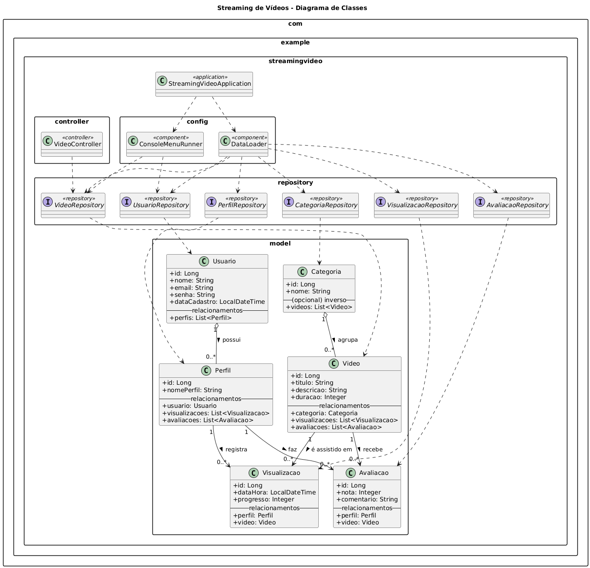

## **"Sistema" de Streaming de Vídeos — SpringBoot + JPA**

Projeto acadêmico demonstrando um sistema de Streaming de vídeos com Spring Boot 3, Spring Data JPA e H2 (memória).
Inclui seed de dados, consultas exigidas, menu interativo no console e endpoints REST.

**✅ Stack**

Java 21

- Spring Boot 3.3.x
- Spring Data JPA / Hibernate
- Banco: H2 (in-memory)
- Build: Maven

**🚀 Como rodar:**

IntelliJ:

- Abra o projeto e sincronize o Maven (M → Reload).
- Build → Rebuild Project.
- Rode a classe StreamingVideoApplication.

**🧩 Diagrama de Classes (UML)**

Equipe: Marcelo Vinicius Leicht, João Vitor Rosera e Vinicius Henrique Werner Hardt
